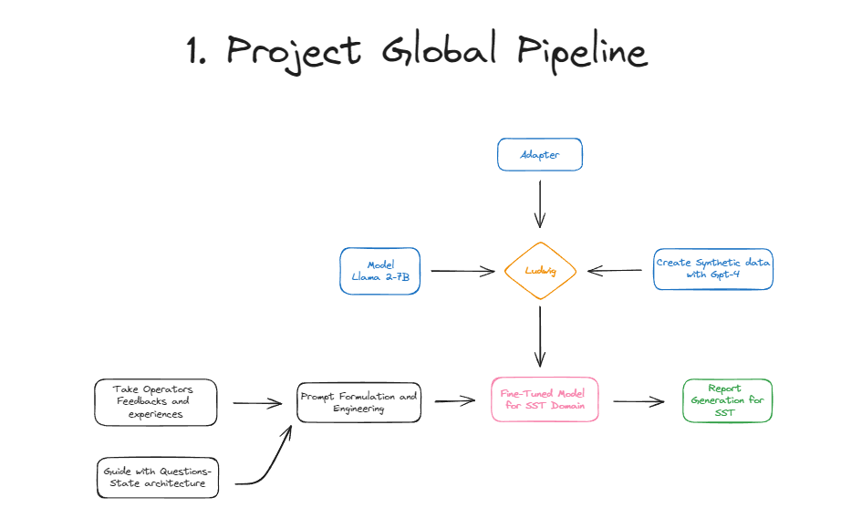
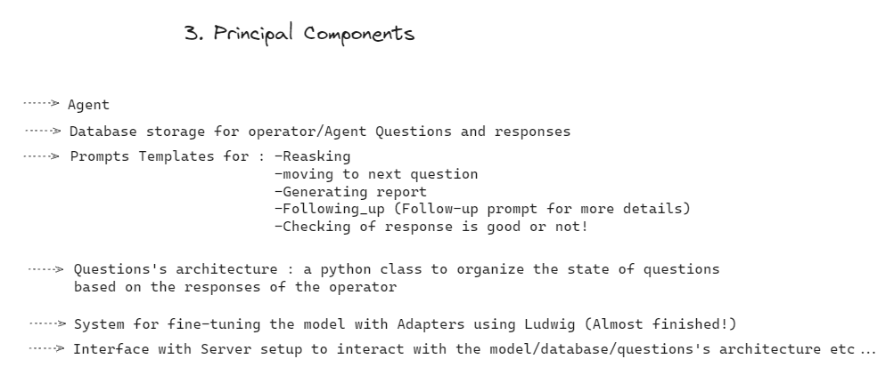

Including images in your README file can significantly enhance its readability and provide visual context to your explanations. Here's how you can update the README to include images:

---

# HSE LLM Report System

## Overview

The Health, Safety, and Environment (HSE) LLM Report System is a conversational AI tool designed for use in industrial environments. It utilizes a Large Language Model (LLM) to interact with operators, gathering insights about work experience, safety, and health conditions. The system aims to generate detailed SST reports on working conditions by evaluating and responding to operators' feedback.



## Features

- **Dynamic Interaction**: Engages with operators to gather detailed information about health, safety, and environmental conditions.
- **Response Evaluation**: Utilizes an AI model to assess the sufficiency of responses from operators.
- **Adaptive Questioning**: Dynamically adjusts the line of questioning based on the quality of responses received.
- **Report Generation**: Compiles the gathered information into structured SST reports.



## System Components

### 1. `PromptsTemplates` Class

This class handles various templates for interaction including reasking questions, moving to the next question, generating reports, and following up for more details.


- **Reasking Functionality**: Politely reasks questions to gain more information if responses are insufficient.
- **Transition to Next Question**: Smoothly moves the conversation to the next relevant topic.
- **Report Generation**: Compiles operator responses into comprehensive reports.

### 2. `ResponseEvaluator` Class

Responsible for evaluating the sufficiency of operators' responses using an advanced AI model.


- **Model Interaction**: Formulates prompts and interprets responses from the AI model to determine response quality.
- **Customizable Evaluation Logic**: Tailored to assess responses based on the context of HSE.

### 3. `QuestionsManager` Class

Manages the flow of questions based on operators' responses.


- **State Management**: Tracks the current question and decides the next step in the conversation.
- **Flow Control**: Decides whether to proceed to the next question or reask based on response sufficiency.

## Installation

To set up the project, follow these steps:

1. Clone the repository:
   ```
   git clone https://github.com/BilalElmanja/HSE-Reporting-with-LLMs.git
   ```
2. Navigate to the project directory:
   ```
   cd HSE_LLM_Report_System
   ```
3. Install dependencies:
   ```
   pip install -r requirements.txt
   ```


## Usage

To use the system, initiate the main script:

```bash
python main.py
```

This will start the conversational agent, ready to interact with operators.


## Contributing

Contributions to the project are welcome! If you have suggestions for improvements or encounter any issues, please feel free to submit an issue or pull request.

## License

This project is licensed under [MIT License](LICENSE).


---
